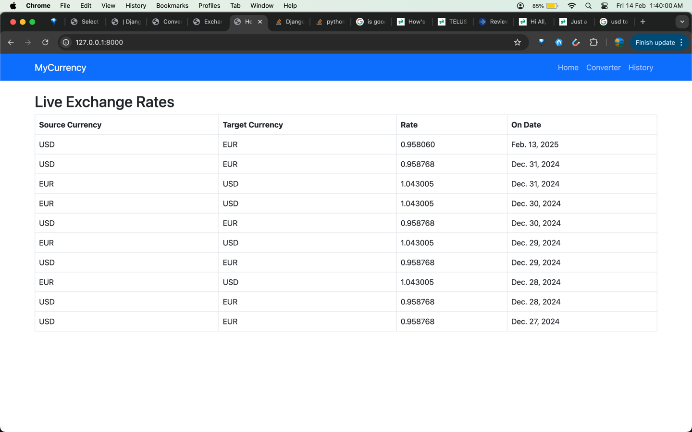
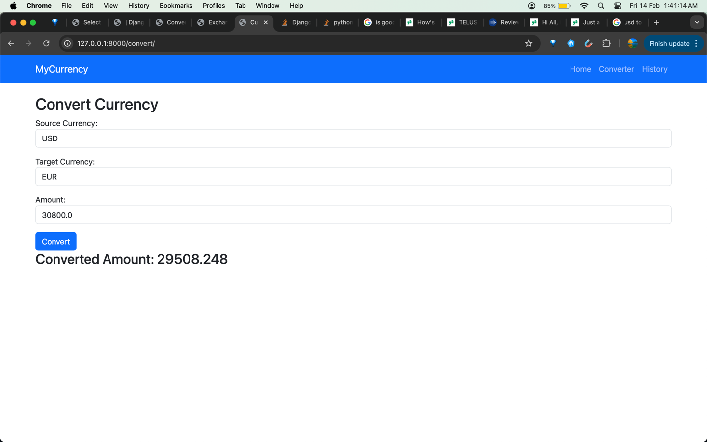
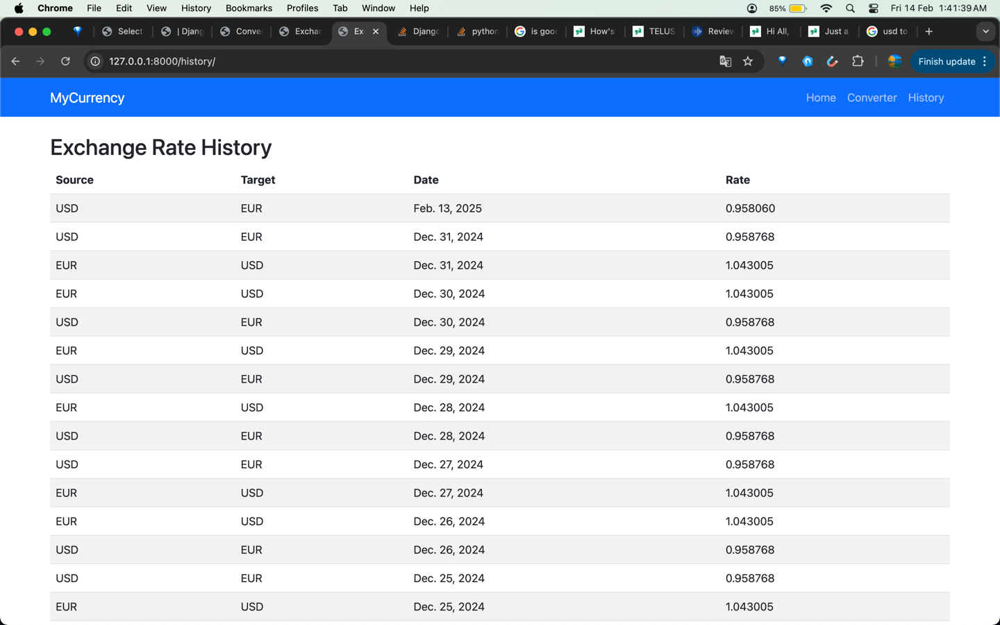
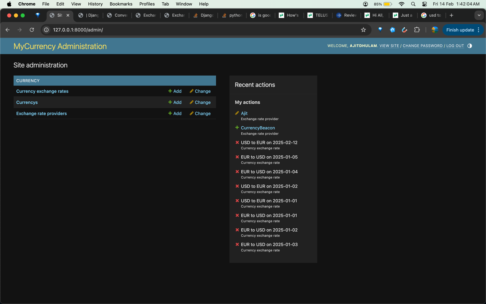
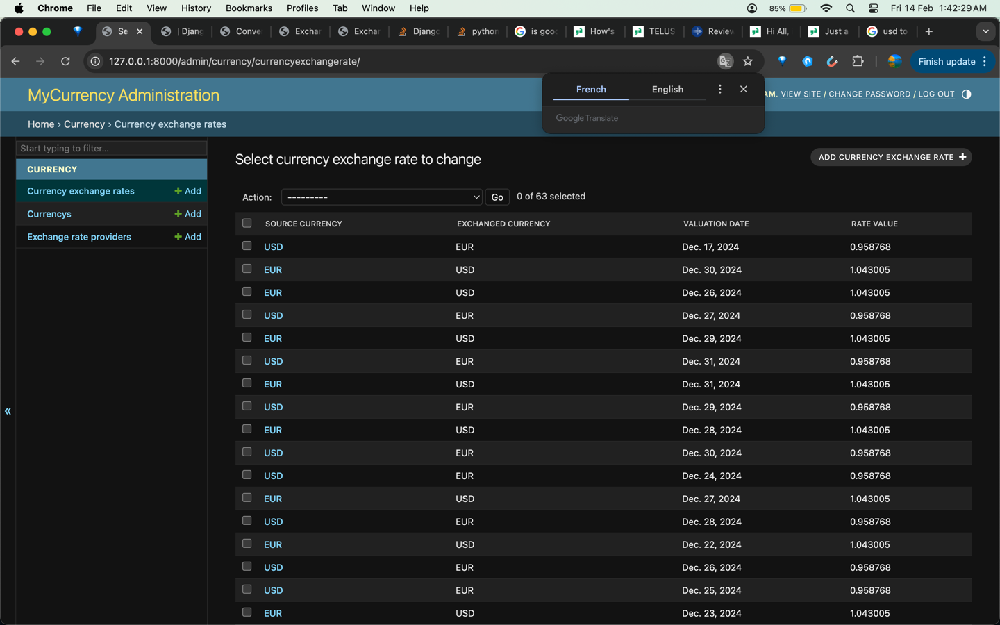
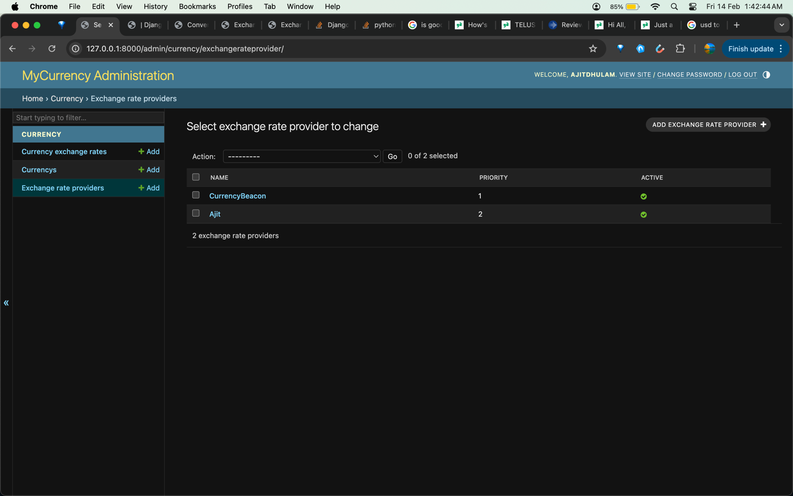
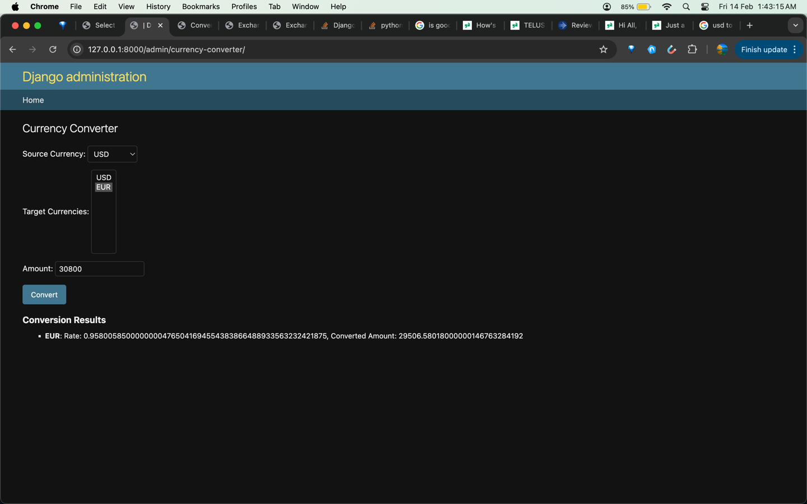
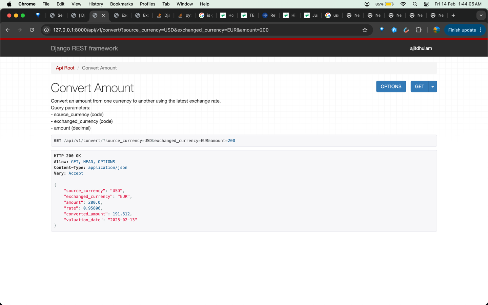
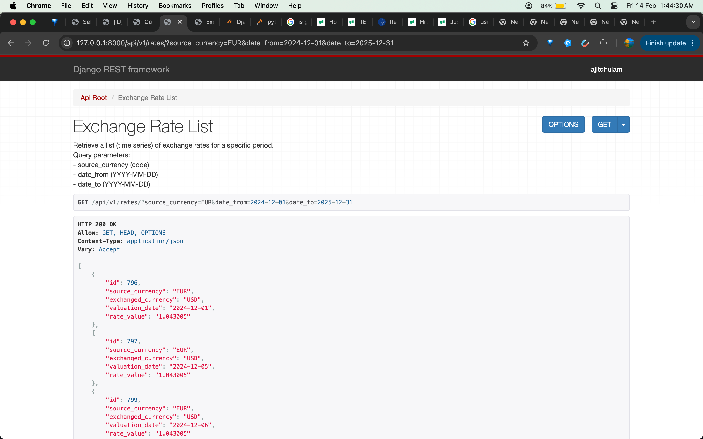
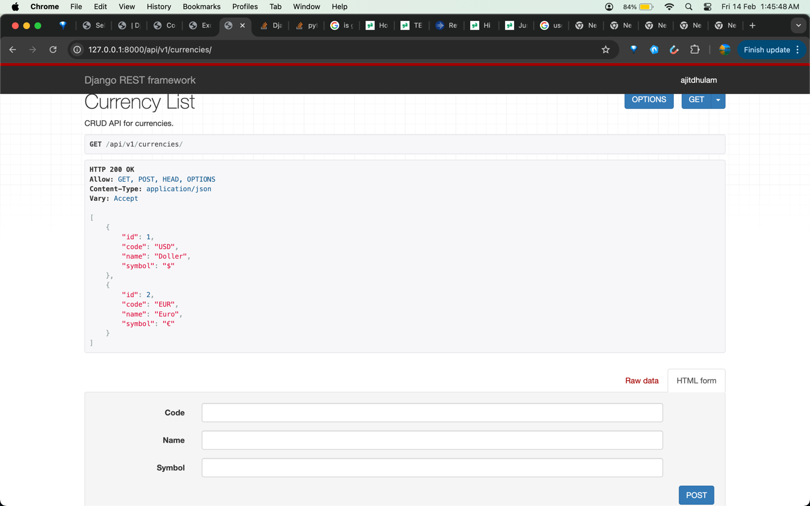

## 📌 **README.md**  


# 🌍 MyCurrency - Django Currency Exchange Platform

MyCurrency is a web-based platform that allows users to calculate exchange rates, convert amounts between currencies, and view historical exchange rate data.  

This project is built with:  
- **Django** (Backend Framework)  
- **Django REST Framework** (API Development)  
- **Bootstrap** (Simple UI)  
- **CurrencyBeacon API** (Live Exchange Rates)  
- **SQLite (or PostgreSQL/MySQL)** for database storage  

---

## 🚀 Features

✔ **Live Exchange Rate Data** (Fetched from CurrencyBeacon & stored in DB)  
✔ **Currency Converter** (Uses both Database & API for accurate results)  
✔ **Historical Exchange Rates** (Stored & displayed with filtering options)  
✔ **Django Admin Interface** (Manage Currencies, Providers & View Data)  
✔ **Asynchronous Historical Data Loading** (Efficient data processing)  
✔ **API Endpoints** (For integration with frontend/mobile apps)  

---


## ⚙️ Installation Guide

### **1️⃣ Clone the Repository**
```bash
    git clone https://github.com/jit01/MyCurrency.git
    cd mycurrency
```

### **2️⃣ Create a Virtual Environment**
```bash
    python3 -m venv env
    source env/bin/activate  # On Windows: env\Scripts\activate
```

### **3️⃣ Install Dependencies**
```bash
  pip install -r requirements.txt
```

### **4️⃣ Set Up Database**
```bash
  python manage.py migrate
```

### **5️⃣ Create Superuser (for Admin Panel)**
```bash
  python manage.py createsuperuser
```
Follow the prompts to create an admin user.

### **6️⃣ Run Development Server**
```bash
  python manage.py runserver
```
Now visit `http://127.0.0.1:8000/` in your browser.

---

## 🖥️ UI Overview (Bootstrap-Based)

| Page | URL | Description |
|------|-----|------------|
| **Home** | `/` | Shows latest exchange rates |
| **Currency Converter** | `/convert/` | Converts an amount between currencies |
| **Exchange History** | `/history/` | Displays historical exchange rates |
| **Admin Panel** | `/admin/` | Manage currencies, providers & exchange rates |
| **Admin Currency Converter** | `/admin/currency-converter/` | Convert currencies inside Django Admin |

---

## 🌍 **API Documentation (Django REST Framework)**

| API Endpoint | Method | Description | Parameters |
|-------------|--------|-------------|------------|
| `/api/currencies/` | GET | List all available currencies | None |
| `/api/currencies/` | POST | Add a new currency | `{ "code": "USD", "name": "US Dollar" }` |
| `/api/rates/` | GET | Get exchange rates for a time period | `source_currency`, `date_from`, `date_to` |
| `/api/convert/` | GET | Convert an amount between two currencies | `source_currency`, `exchanged_currency`, `amount` |

Example API call using **Postman or cURL**:
```bash
curl -X GET "http://127.0.0.1:8000/api/convert/?source_currency=USD&exchanged_currency=EUR&amount=100"
```

---

## ⚡ **Historical Data Processing (Async Task)**
To load historical exchange rate data efficiently, run:

```bash
python manage.py load_historical_data --start=2024-01-01 --end=2024-12-31
```

This will **fetch and store** thousands of past exchange rates asynchronously.

---

## 🔧 **Environment Variables (For Production)**
In production, use **environment variables** for sensitive keys:

```bash
export CURRENCY_BEACON_API_KEY="your_api_key"
export CURRENCY_BEACON_BASE_URL="https://api.currencybeacon.com/v1"
```

or create a `.env` file and use **django-environ**.


---

## 🚀 **Deployment**
To deploy on **Heroku, AWS, or DigitalOcean**, follow these steps:

### **1️⃣ Install Gunicorn & Whitenoise**
```bash
pip install gunicorn whitenoise
```

### **2️⃣ Update `requirements.txt`**
```bash
pip freeze > requirements.txt
```

### **3️⃣ Configure `settings.py` for Production**
```python
ALLOWED_HOSTS = ['yourdomain.com']
DEBUG = False
STATIC_ROOT = BASE_DIR / 'staticfiles'
MIDDLEWARE.insert(1, 'whitenoise.middleware.WhiteNoiseMiddleware')
```

### **4️⃣ Run Production Server**
```bash
gunicorn mycurrency.wsgi:application --bind 0.0.0.0:8000
```

---
## 🖥️ UI Preview

### HomePage




### AdminPage





### RestAPIPage





---

## 🎯 **Future Improvements**
🔹 **Improve Caching (Redis or Django Cache Framework)**  
🔹 **Add Celery for Background Tasks**  
🔹 **Enhance UI with Chart.js for Historical Trends**  
🔹 **Implement API Rate Limiting**  

---

## 🏆 **Contributions & Support**
Feel free to **fork** this repository, submit **pull requests**, or report **issues**. Contributions are welcome!  

For any help, contact: **ajitdhulam@gmail.com**

😃
---


